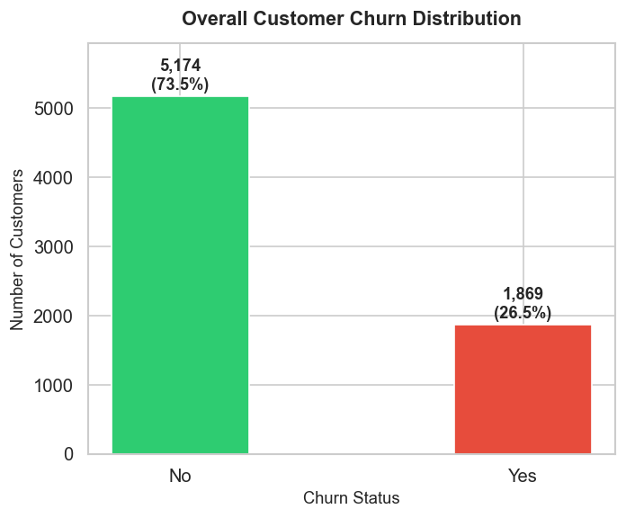
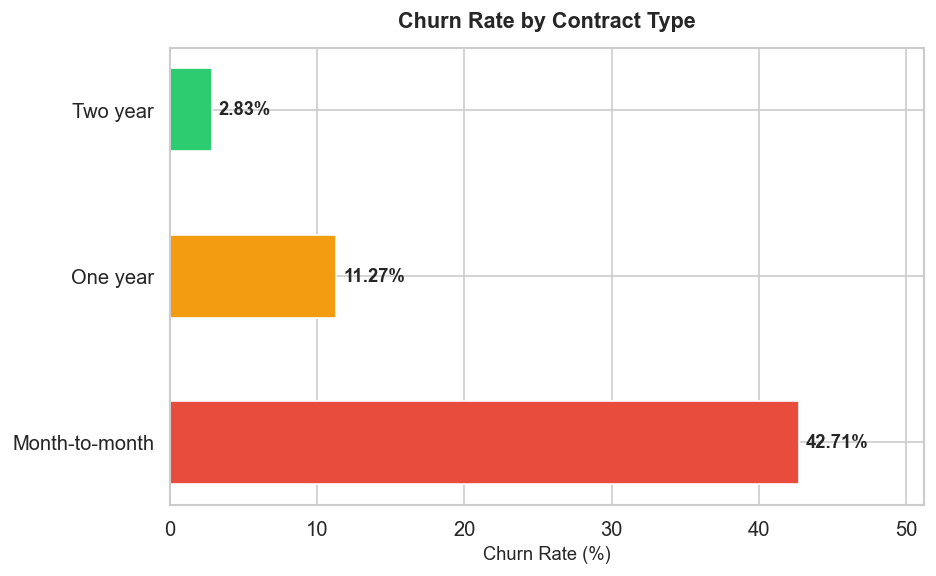
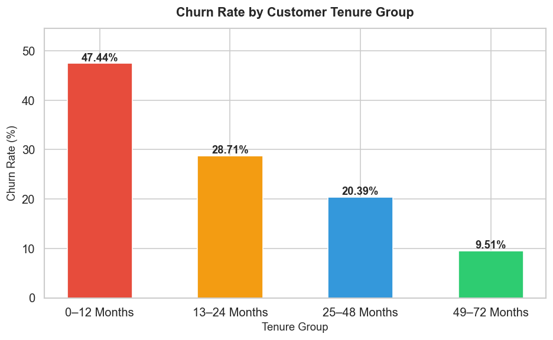
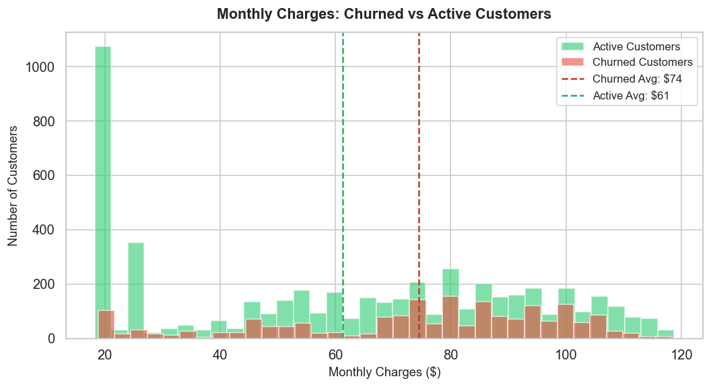
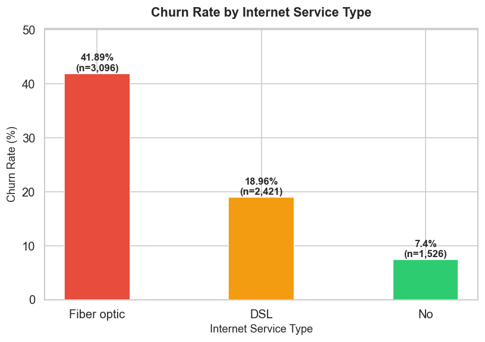
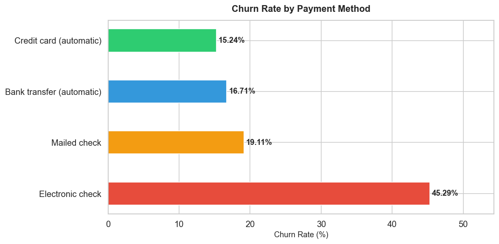
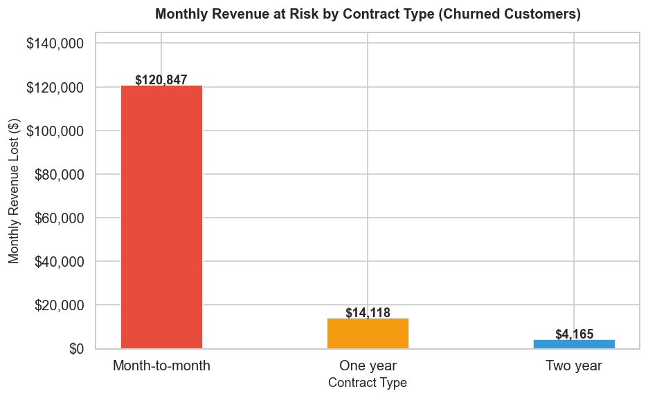
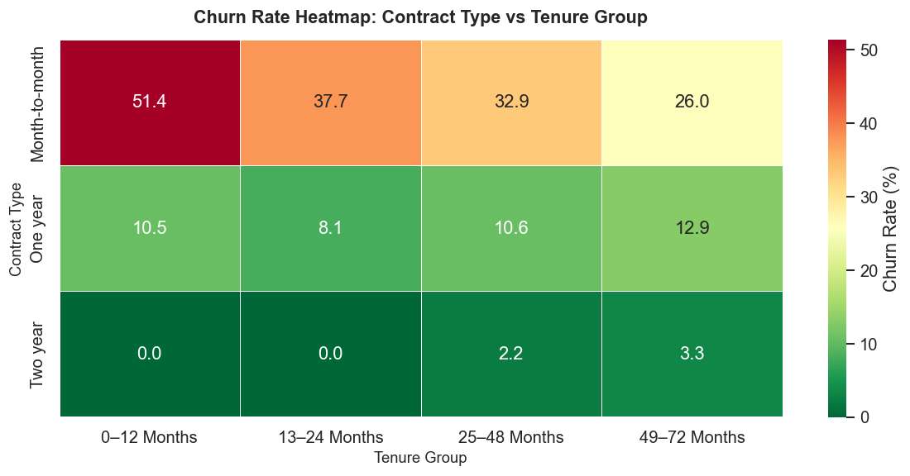
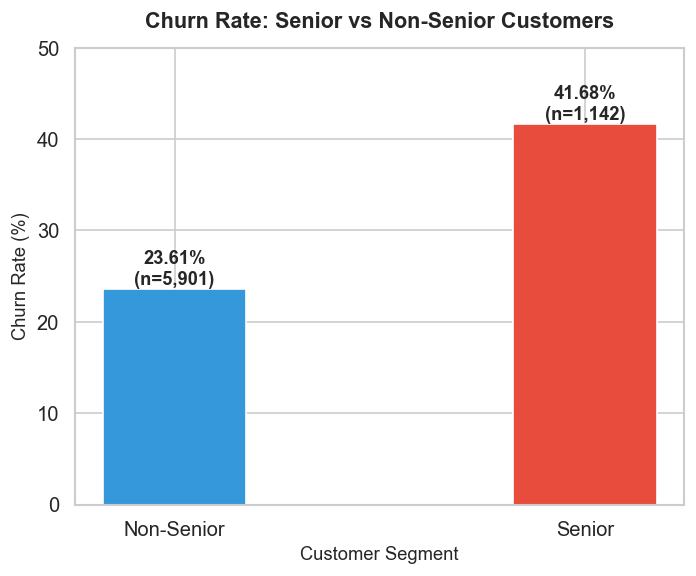
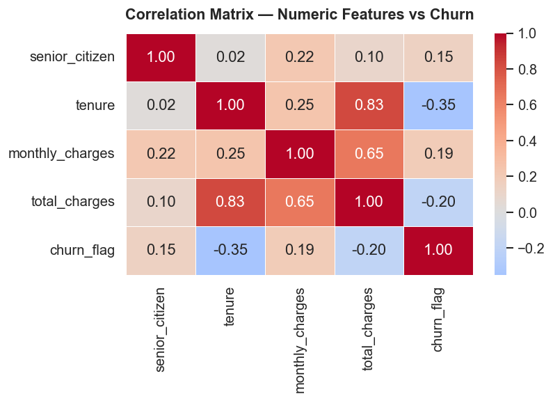

# Telecom Customer Churn & Revenue Analytics

**Data Analyst:** Subhash Gautam  
**Domain:** Telecom | B2C Subscription Services  
**Dataset:** IBM Telco Customer Churn (Kaggle)  
**Tools:** PostgreSQL · Python (Pandas, Matplotlib, Seaborn) · Power BI  

---

## Table of Contents

- [Business Problem](#business-problem)
- [Project Objective](#project-objective)
- [Dataset Information](#dataset-information)
- [Tools Used](#tools-used)
- [Project Structure](#project-structure)
- [Key Business KPIs](#key-business-kpis)
- [SQL Skills Demonstrated](#sql-skills-demonstrated)
- [Python Skills Demonstrated](#python-skills-demonstrated)
- [Key Findings](#key-findings)
- [Visualizations](#visualizations)
- [Power BI Dashboard](#power-bi-dashboard)
- [Business Recommendations](#business-recommendations)
- [How to Run](#how-to-run)
- [Author](#author)

---

## Business Problem

A mid-sized telecom company is experiencing a **26.54% customer churn rate**, resulting in **$139,130 of monthly recurring revenue loss**. The retention team has no clear visibility into which customer segments are churning, why they are leaving, or where to focus retention budget for maximum impact.

The business needs a data-driven investigation to identify churn patterns, quantify financial exposure, and produce a high-risk customer list for the retention team to act on immediately.

---

## Project Objective

1. Quantify the overall churn rate and monthly revenue at risk
2. Identify the key drivers of churn — contract type, tenure, internet service, payment method
3. Segment customers by churn risk profile and lifetime value
4. Build a high-risk active customer list for targeted retention campaigns
5. Deliver an executive-ready Power BI dashboard with actionable KPIs

---

## Dataset Information

| Attribute | Details |
|-----------|---------|
| Source | [IBM Telco Customer Churn — Kaggle](https://www.kaggle.com/datasets/blastchar/telco-customer-churn) |
| Records | 7,043 customers |
| Columns | 21 features |
| Domain | Telecom — B2C Subscription Services |
| Structure | Single flat table |
| Target Variable | Churn (Yes / No) |

### Feature Overview

| Feature | Description |
|---------|-------------|
| customerID | Unique customer identifier |
| gender | Male / Female |
| SeniorCitizen | 1 = Senior (65+), 0 = Non-Senior |
| Partner | Has a partner (Yes/No) |
| Dependents | Has dependents (Yes/No) |
| tenure | Months with the company (0–72) |
| PhoneService | Subscribed to phone service |
| MultipleLines | Has multiple phone lines |
| InternetService | DSL / Fiber optic / No |
| OnlineSecurity | Add-on service (Yes/No/No internet) |
| OnlineBackup | Add-on service (Yes/No/No internet) |
| DeviceProtection | Add-on service (Yes/No/No internet) |
| TechSupport | Add-on service (Yes/No/No internet) |
| StreamingTV | Streaming TV subscription |
| StreamingMovies | Streaming movies subscription |
| Contract | Month-to-month / One year / Two year |
| PaperlessBilling | Enrolled in paperless billing |
| PaymentMethod | Electronic check / Mailed check / Bank transfer / Credit card |
| MonthlyCharges | Current monthly bill ($) |
| TotalCharges | Cumulative charges to date — had blank values for new customers |
| Churn | Target variable — Yes / No |

### Data Quality Issues Found and Fixed

| Issue | Details | Resolution |
|-------|---------|------------|
| Blank TotalCharges | 11 new customers (tenure = 0) had blank strings | Converted to NUMERIC; blanks filled with 0 |
| TotalCharges imported as VARCHAR | Blanks prevented direct NUMERIC import in PostgreSQL | Added total_charges_clean NUMERIC column via ALTER + UPDATE |
| Inconsistent churn casing | Mixed case values possible | Standardized using INITCAP() in SQL and map() in Python |
| No tenure segmentation | Raw tenure (0–72) not useful for group analysis | Added tenure_group derived column in both SQL and Python |
| senior_citizen as 0/1 integer | Not readable in dashboards | Mapped to Senior / Non-Senior labels |

---

## Tools Used

| Tool | Purpose |
|------|---------|
| PostgreSQL 16 | Database creation, data cleaning, all SQL analysis |
| pgAdmin 4 | Query execution and result verification |
| Python 3.11 | EDA, KPI calculations, all 10 visualizations |
| Pandas | Data loading, cleaning, transformation, groupby analysis |
| NumPy | Numerical operations |
| Matplotlib | Bar charts, histograms, reference lines |
| Seaborn | Heatmaps, styled charts |
| Power BI Desktop | 2-page interactive dashboard with DAX measures |
| GitHub | Version control and portfolio hosting |

---

## Project Structure

```
Telecom-churn-revenue-analytics/
│
├── gitignore
├── README.md
│
├── Report/
│   └── Telecom_Churn_Analysis_Report.md
│   └── Telecom_Churn_Analysis_Report.pdf
├── SQL/
│   └── IBM Telco.sql
│
├── Jupyter Notebook/
│   └── telecom_churn_eda.ipynb
│
├── Outputs/
│   ├── 01_churn_distribution.png
│   ├── 02_churn_by_contract.png
│   ├── 03_churn_by_tenure_group.png
│   ├── 04_monthly_charges_distribution.png
│   ├── 05_churn_by_internet_service.png
│   ├── 06_churn_by_payment_method.png
│   ├── 07_revenue_at_risk_by_contract.png
│   ├── 08_churn_heatmap_contract_tenure.png
│   ├── 09_churn_senior_vs_non_senior.png
│   └── 10_correlation_heatmap.png
│
└── Power BI/
    ├── Telecom_churn_analysis-page-0001.jpg
    ├── Telecom_churn_analysis-page-0002.jpg
    └── Telecom_churn_analysis-page-0003.jpg
```

---

## Key Business KPIs

| KPI | Value |
|-----|-------|
| Total Customers | 7,043 |
| Churned Customers | 1,869 |
| Overall Churn Rate | **26.54%** |
| Active Customers | 5,174 |
| Total Monthly Revenue | $456,117 |
| Monthly Revenue Lost | **$139,130** |
| Average CLV (Lifetime Value) | $2,283.30 |
| Avg Monthly Charge — Churned | $74.44 |
| Avg Monthly Charge — Active | $61.27 |
| Month-to-Month Churn Rate | 42.71% |
| Year-1 Customer Churn Rate | 47.44% |

---

## SQL Skills Demonstrated

| Skill | Used In |
|-------|---------|
| CREATE TABLE with appropriate data types | Section 1 — Database Setup |
| ALTER TABLE + UPDATE for schema evolution | Section 2.4 — total_charges_clean |
| FILTER (WHERE ...) inside aggregates | Q1 through Q11 |
| CASE WHEN for conditional labeling | Q3, Q6, Q15 |
| GROUP BY with multiple dimensions | Q4, Q8, Q10, Q13 |
| ORDER BY with custom CASE sort | Q6 — tenure_group ordering |
| ROUND(), AVG(), SUM(), COUNT() aggregates | Q5, Q7, Q9, Q10, Q13 |
| WINDOW FUNCTIONS — RANK() OVER, SUM() OVER | Q1, Q12, Q14 |
| CTE — WITH clause | Q12, Q13, Q14 |
| HAVING clause | Duplicate check |
| Running cumulative totals | Q14 — cumulative churn by tenure |
| Multi-condition WHERE filter | Q15 — high-risk identification |
| Data standardization with INITCAP() | Section 2.6 |
| DISTINCT for data validation | Sections 2.2, 2.6 |
| TRIM() for whitespace handling | Section 2.4 |

---

## Python Skills Demonstrated

| Skill | Used In |
|-------|---------|
| pd.read_csv() | Data loading |
| pd.to_numeric(errors='coerce') | TotalCharges fix |
| fillna() | Missing value handling |
| rename(columns={}) | Column standardization |
| Custom function + .apply() | tenure_group derivation |
| .map() for label encoding | senior_label, churn_flag |
| groupby().agg() with multiple functions | KPI calculations throughout |
| pd.Categorical() with ordered=True | Correct tenure group sort order |
| sort_values() | Chart ordering |
| Boolean indexing | High-risk segment filtering |
| plt.subplots() | All 10 chart figures |
| ax.bar(), ax.barh(), ax.hist() | Bar, horizontal, histogram charts |
| ax.axvline() | Mean reference lines |
| ax.text() | Data label annotations on all charts |
| sns.heatmap() | Charts 8 and 10 |
| mticker.FuncFormatter | Dollar axis formatting |
| plt.savefig() | Saving all 10 charts to Outputs folder |
| os.makedirs() | Output directory creation |

---

## Key Findings

**1. Overall churn rate is 26.54% — nearly 1 in 4 customers is leaving.**
Churned customers pay a $13 higher average monthly charge ($74 vs $61), meaning the company is losing its higher-paying customers at a disproportionate rate.

**2. Contract type is the single strongest predictor of churn.**
Month-to-month contracts carry a 42.71% churn rate — 15 times higher than two-year contracts (2.83%). Month-to-month customers account for $120,847 (87%) of all monthly revenue lost.

**3. First 12 months is the most critical retention window.**
Customers in their first year churn at 47.44%. This drops to 28.71% in year 2 and 9.51% after year 4. The most dangerous combination is Month-to-month + 0–12 months = 51.4% churn rate.

**4. Fiber optic internet has an alarming churn rate.**
Fiber optic customers churn at 41.89% versus 18.96% for DSL — more than double. These customers also carry higher monthly charges (~$87 ARPU), making this the highest-value revenue loss in the dataset.

**5. Electronic check payment is the highest churn signal.**
Electronic check users churn at 45.29% — nearly 3x the rate of credit card users (15.24%). Auto-pay methods consistently show 15–17% churn across both bank transfer and credit card segments.

**6. Senior citizens churn at nearly double the rate of non-seniors.**
Senior churn rate: 41.68% vs 23.61% for non-seniors. Seniors represent 16.2% of the customer base but 25.5% of all churned customers.

**7. CLV gap between contract types is extreme.**
Two-year contract CLV: $3,728.93 vs Month-to-month CLV: $1,369.25 — a gap of $2,359 per customer, driven entirely by retention duration rather than pricing differences.

**8. Longer tenure strongly predicts lower churn.**
Tenure has a -0.35 Pearson correlation with churn — the strongest numeric predictor in the dataset. Monthly charges show +0.19 correlation, confirming higher-bill customers are slightly more likely to churn.

---

## Visualizations

### Chart 1 — Overall Customer Churn Distribution


### Chart 2 — Churn Rate by Contract Type


### Chart 3 — Churn Rate by Customer Tenure Group


### Chart 4 — Monthly Charges: Churned vs Active Customers


### Chart 5 — Churn Rate by Internet Service Type


### Chart 6 — Churn Rate by Payment Method


### Chart 7 — Monthly Revenue at Risk by Contract Type


### Chart 8 — Churn Rate Heatmap: Contract Type vs Tenure Group


### Chart 9 — Churn Rate: Senior vs Non-Senior Customers


### Chart 10 — Correlation Matrix: Numeric Features vs Churn


---

## Power BI Dashboard

The Power BI dashboard covers two pages of analysis.

**Page 1 — Executive Summary**


KPI cards: Churned Customers, Churn Rate, Total Revenue, Active Customers, Average CLV, Monthly Revenue Lost. Includes churned customers by gender, demographic breakdown by senior/partner/dependent status, subscription time bar chart, payment method and contract type churn bars, internet service breakdown, and cumulative churn growth by tenure line chart.

**Page 2 — Advanced Analysis**


ARPU vs CLV performance summary by contract type, payment method revenue and churn risk table, top 10 high-value customer profiles (CLV analysis), churn rate by tenure group chart, and high-risk active customer retention action list.

**Page 3 — Retention Action List**


Scrollable table of high-risk active customers filtered by: Month-to-month contract, Fiber optic internet, Electronic check payment, and tenure under 12 months — ready for the retention team to action.


---

## Business Recommendations

**Recommendation 1 — Contract Migration Campaign (Critical)**
Convert month-to-month customers to annual contracts. Offer 1 month free plus locked-in pricing. Even moving 20% of at-risk monthly customers to one-year contracts could reduce monthly revenue loss by approximately $24,000.

**Recommendation 2 — First 90 Days Onboarding Program (High)**
Deploy structured onboarding for all new customers: welcome call at Day 7, usage check-in at Day 30, satisfaction survey at Day 60, upgrade offer at Day 90. The 47.44% churn rate in Year 1 is the single largest retention opportunity in the dataset.

**Recommendation 3 — Auto-Pay Migration Drive (High)**
Offer a $5–$10 monthly bill discount for switching from electronic check to bank transfer or credit card auto-pay. The 30 percentage point churn gap between electronic check and auto-pay methods makes this financially justified.

**Recommendation 4 — Fiber Optic Quality Investigation (High)**
Conduct exit surveys with recently churned Fiber optic customers. Analyze support ticket volume and resolution time for Fiber users. Review pricing competitiveness. Identify if churn is concentrated in specific geographic areas pointing to infrastructure issues.

**Recommendation 5 — Senior Citizen Dedicated Plan (Medium)**
Create a plan with simplified pricing, dedicated phone support, and loyalty rewards at 12-month and 24-month milestones. With 41.68% churn in this segment, even a 10% reduction saves significant monthly revenue.

**Recommendation 6 — Add-On Service Bundling at Onboarding (Medium)**
Offer Online Security plus Tech Support as a 3-month free trial for all new customers. Add-on adoption reduces churn through switching costs while increasing ARPU upon conversion.

**Recommendation 7 — Monthly High-Risk Customer Report (Ongoing)**
Run the high-risk identification query (SQL Section 6, Q15) on live customer data each month. Export results to the retention team's CRM. Assign agents to each identified customer for outreach before their next billing cycle.

---

## How to Run

### Step 1 — Get the Dataset
Download from Kaggle: [IBM Telco Customer Churn](https://www.kaggle.com/datasets/blastchar/telco-customer-churn)  
File: `WA_Fn-UseC_-Telco-Customer-Churn.csv`

### Step 2 — Run the SQL Project
1. Open pgAdmin 4 and connect to your PostgreSQL server
2. Create a new database named `telecom_churn`
3. Open `SQL/IBM Telco.sql`
4. Import the CSV into the `telco_customers` table via pgAdmin Import tool — Format: CSV, Header: Yes, Encoding: UTF-8
5. Run all queries section by section

### Step 3 — Run the Python EDA

```bash
cd Python/
pip install pandas numpy matplotlib seaborn
python telecom_churn_eda.py
```

Update the CSV file path in the script before running. All 10 charts save to the `Outputs/` folder automatically.

### Step 4 — View the Power BI Dashboard
Open the JPG files in the `Power BI/` folder for the dashboard export.

---

## How to Run This Project

```
Raw CSV Dataset (Kaggle)
        |
        v
PostgreSQL — Data Cleaning + 15 Business Queries (SQL/IBM Telco.sql)
        |
        v
Python EDA — 10 Visualizations + KPI Summary (Python/telecom_churn_eda.py)
        |
        v
Power BI — 3-Page Interactive Dashboard (Power BI/)
        |
        v
Business Recommendations + Retention Action List
```

---

## Author

**Subhash Gautam**  
Data Analyst

- LinkedIn: [linkedin.com/in/subhash-gautam-a6126626b](https://www.linkedin.com/in/subhash-gautam-a6126626b/)
- GitHub: [github.com/subhashgautam788-DS](https://github.com/subhashgautam788-DS)
- Email: subhashgautam788@gmail.com

---

## Other Portfolio Projects

| Project | Domain | Tools |
|---------|--------|-------|
| [Olist E-Commerce Analysis](https://github.com/subhashgautam788-DS/Olist-Ecommerce-Analysis) | E-Commerce | PostgreSQL, Excel, Power BI |
| Telecom Churn & Revenue Analytics *(this project)* | Telecom | PostgreSQL, Python, Power BI |

---

*Dataset used under Kaggle open dataset terms for educational and portfolio purposes.*
